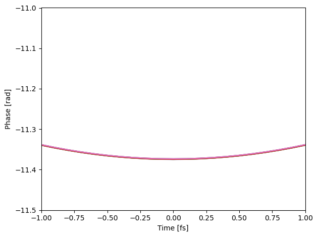

For the english version, please scroll down.

# NTP-NFTÖ-23-0814

Ez a projekt tartalmazza a Lehotai Levente által kidolgozott C++ nyelven kidolgozott kódokat az NTP-NFTÖ-23-0814 pályázathoz.

A különböző mappák az adott differenciál egyenlet megoldását különböző módokon teszik meg. Az első két karakter utal a programkód párhuzamosítására:

- st: _Single threaded_, vagyis egy szálon fut, semmlyen párhuzamosítás nincs jelen.
- mt: _Multi-threaded_, vagyis a CPU-n több szálon fut
- cu: A CUDA programozási környezetre utal, amely az nVidia videókártyákon történő számítások futtását teszi lehetővé. Masszívan párhuzamosított.

A mappa további része a differenciálegyenlet matematikai megoldására utal:

- Rk4: 4-ed rendű Runge-Kutta: [link](https://hu.wikipedia.org/wiki/Runge%E2%80%93Kutta-m%C3%B3dszer)
- ABM: Prediktor-korrektor módszer, amelyben az előbbi módszer a prediktor, az korraktor pedig a [Adams-Moulton módszer](https://en.wikipedia.org/wiki/Linear_multistep_method).

Minden egyes mappa külön-külön el van látva Makefile-lal a könnyebb fordítás érdekében. A fejlesztés Windows operációs rendszeren történt MSVC fodítóval.

A run.bat file mindegyik projektet lefordítja és futtatja, illetve a kimenetét mindegyik mappa data mappájába menti, a mappa nevének megfelelően elnevezve.

A lefuttatott kódok helyességének ellőrzéséhez megtalálható a notebook.ipynb nevő Jupyter notebook, amely beolvassa ezeket a fájlokat, és kiábrázolja őket egymáson. A lenti ábra ennek a notebooknak a kimenete, amely jól mutatja, hogy hogy a sok görbe egymástól nem megkülönböztethető módon egymáson vannak. Az ábra csak a t=0 körül ábrázolja a fázist, amelynek az oka, hogy a differenciálegyenlet a függvény amplitúdóját nem befolyásolja, míg a fázisban a 0 pont körül lesz a legnagyobb az eltérés.

# NTP-NFTÖ-23-0814

English version to be added.
